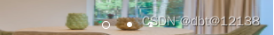

# 微信小程序——swiper轮播图自定义指示样式

> 原创 于 2022-08-17 17:52:22 发布 · 593 阅读 · 0 · 0 · 本内容遵循CC 4.0 BY-SA版权协议 版权声明：本文为博主原创文章，遵循 CC 4.0 BY-SA 版权协议，转载请附上原文出处链接和本声明。
> 文章链接：https://blog.csdn.net/qq_43201350/article/details/126391325

js文件

```js
  data: {
    styleType:1,
    pointerStyle:4,
    imageList:[
      {src:'../../static/Rectangle 6.png'},
      {src:'../../static/Rectangle 6.png'},
      {src:'../../static/Rectangle 6.png'},
    ],
    largeCurrentSwiper:0
  },
  swiperChange(e){
    this.setData({
      largeCurrentSwiper:e.detail.current
    })
  },
```

wxml文件

```vue
<!-- swiper 自定义指示样式 -->
<swiper class="{{styleType === 1 ? 'pointOne' : styleType === 2 ? 'pointTwo' : styleType === 3 ? 'pointThree' : styleType === 5 ? 'pointFive' : ''}}" current="{{largeCurrentSwiper}}" bindchange="swiperChange">
  <swiper-item wx:for="{{imageList}}" style="position: relative;margin: 0 9%;">
    <image src="{{item.src}}"></image>
    <!-- 其它样式 -->
    <view class="dots" style="position: absolute;left: 40%;bottom: 10%;transform: translate(-50%, 50%);" wx:if="{{pointerStyle !== 4}}">
      <block wx:for="{{3}}">
        <view class="{{largeCurrentSwiper === index && pointerStyle === 1 ? 'dotOneActive' : pointerStyle === 1 ? 'dotOneUnActive' : ''}}  {{largeCurrentSwiper === index && pointerStyle === 2 ? 'dotTwoActive' : pointerStyle === 2 ? 'dotTwoUnActive' : ''}} {{largeCurrentSwiper === index && pointerStyle === 3 ? 'dotThreeActive' : pointerStyle === 3 ? 'dotThreeUnActive' : ''}} {{largeCurrentSwiper === index && pointerStyle === 5 ? 'dotFiveActive' : pointerStyle === 5 ? 'dotFiveUnActive' : ''}}"></view>
      </block>
    </view>

    <!-- 样式四 -->
    <view class='bannerNum' wx:if="{{pointerStyle === 4}}" style="display: flex;justify-content: center;left: 10%;bottom: 10%;transform: translate(-50%, 50%);">
          <view style="position: relative;">
            <view style="width: 50rpx;height: 50rpx;border-radius: 50%;background: #000;position: absolute;left:-40%;top: 0;"></view>
            <view style="width: 50rpx;height: 50rpx;border-radius: 50%;background: #000;position: absolute;left: 40%;top: 0;"></view>
            <text style="z-index: 100;position: relative;text-align: center;">{{(largeCurrentSwiper+1)}}/{{imageList.length}}</text>
          </view>
        </view>
  </swiper-item>
</swiper>
```

```css
.dots{  
  width:250rpx;
  height: 36rpx; 
  display: flex;
  flex-direction: row;
  justify-content: center;
  align-items: center;
  position: absolute;
  transform: translate(-50%, -50%);
}  
/* 指示样式1 */

/*未选中时的小圆点样式 */
.dotOneUnActive{    
  width: 1200rpx;
  height: 2rpx;
  background-color: #95918e;
}  
/*选中以后的小圆点样式  */
.dotOneActive {
  width: 1200rpx;
  height: 7rpx;
  background-color: #fff;
  display: flex;
  justify-content: center;
  align-items: center;
  margin: -3rpx;
}

/* 指示样式2 */

/*未选中时的小圆点样式 */
.dotTwoUnActive{    
  width: 13rpx;
  height: 13rpx;
  background-color: #fff;
  border-radius: 50%;
  margin: 0 7%;

}  
/*选中以后的小圆点样式  */
.dotTwoActive {
  width: 18rpx;
  height: 18rpx;
  background-color:transparent;
  border: 1px solid #fff;
  border-radius: 50%;
  margin: 0 7%;
  box-sizing: border-box;
}


/* 指示样式3 */

/*未选中时的小圆点样式 */
.dotThreeUnActive{    
  width: 16rpx;
  height: 16rpx;
  background: rgba(255,255,255,0.4000);
  border-radius: 50%;
  margin: 0 7%;

}  
/*选中以后的小圆点样式  */
.dotThreeActive {
  width: 48rpx;
  height: 15rpx;
  background: #FFFFFF;
  border-radius: 6px ;
  margin: 0 7%;
}

/* 指示样式5 */

/*未选中时的小圆点样式 */
.dotFiveUnActive{    
  width: 1200rpx;
  height: 4rpx;
  background-color: #95918e;
}  
/*选中以后的小圆点样式  */
.dotFiveActive {
  width: 1200rpx;
  height: 4rpx;
  background-color: #fff;
  display: flex;
  justify-content: center;
  align-items: center;
  margin: -3rpx;
}


.bannerNum {
  width: 150rpx;
  height: 50rpx;
  line-height: 50rpx;
  text-align: center;
  position: absolute;
  left: 3%;
  bottom: 5%;
  color: #fff;
  font-size: 30rpx;
  display:flex;
  
}
```

样式如下：

 ![[外链图片转存失败,源站可能有防盗链机制,建议将图片保存下来直接上传(img-myHOohfR-1660729864744)(C:\Users\Administrator\Desktop\新建文件夹\1.png)]](./assets/031_1.png)

 

 ![[外链图片转存失败,源站可能有防盗链机制,建议将图片保存下来直接上传(img-NtrWCHFg-1660729864748)(C:\Users\Administrator\Desktop\新建文件夹\3.png)]](./assets/031_3.png)

 ![[外链图片转存失败,源站可能有防盗链机制,建议将图片保存下来直接上传(img-ZWB97hFy-1660729864748)(C:\Users\Administrator\Desktop\新建文件夹\4.png)]](./assets/031_4.png)

 ![[外链图片转存失败,源站可能有防盗链机制,建议将图片保存下来直接上传(img-aENbAT6Z-1660729864749)(C:\Users\Administrator\Desktop\新建文件夹\5.png)]](./assets/031_5.png)

