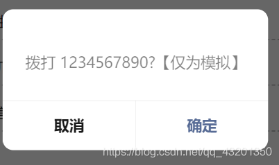

# 微信小程序——拨打电话组件的封装

> 原创 已于 2022-07-10 10:18:45 修改 · 667 阅读 · 0 · 2 · 本内容遵循CC 4.0 BY-SA版权协议 版权声明：本文为博主原创文章，遵循 CC 4.0 BY-SA 版权协议，转载请附上原文出处链接和本声明。
> 文章链接：https://blog.csdn.net/qq_43201350/article/details/117629818

**callPhone组件** 

**callPhone.wxml** 

```
<text class="iconfont icondadianhua" bindtap="handleCallPhone"></text>
```

**callPhone.js** 

```
// components/callPhone/callPhone.js
Component({
  /**
   * 组件的属性列表
   */
  // apply-shared 表示页面 wxss 样式将影响到自定义组件，但自定义组件 wxss 中指定的样式不会影响页面
  options: {
    styleIsolation:  'apply-shared'
  },
  properties: {
    phoneNumber: String
  },

  /**
   * 组件的初始数据
   */
  data: {

  },

  /**
   * 组件的方法列表
   */
  methods: {
    handleCallPhone () {
      wx.makePhoneCall({
        phoneNumber: this.data.phoneNumber,
      })
    }
  }
})

```

**引用：** 

**demo.wxml** 

```
  <text>手机号：</text> 
<callPhone phoneNumber="{{1234567890}}"/>
```

**demo.json** 

```
{
  "usingComponents": {
    "callPhone": "../../components/callPhone/callPhone",
  }
}
```

**效果** 



