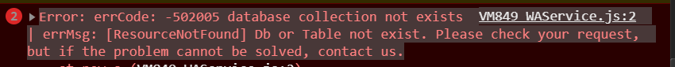

# 微信小程序——云开发报错

> 原创 于 2021-07-18 20:51:01 发布 · 685 阅读 · 0 · 0 · 本内容遵循CC 4.0 BY-SA版权协议 版权声明：本文为博主原创文章，遵循 CC 4.0 BY-SA 版权协议，转载请附上原文出处链接和本声明。
> 文章链接：https://blog.csdn.net/qq_43201350/article/details/118882900



```
VM849 WAService.js:2 Error: errCode: -502005 database collection not exists | errMsg: [ResourceNotFound] Db or Table not exist. Please check your request, but if the problem cannot be solved, contact us.
```

**原因：可能是集合名称写错了** 

集合应为users, 而我写成了user

 

```
    db.collection('user').where({
      location: _.geoNear({
        geometry: db.Geo.Point(this.data.longitude, this.data.latitude),
        // 最大距离与最小距离，单位为米
        minDistance: 0,
        maxDistance: 100000
      }),
      // 当用户开启位置共享时，才可获取附近人的信息
      isLocation: true
    }).field({
      latitude: true,
      longitude: true,
      userPhoto: true
    }).get().then((res) => {
      console.log(res.data, 'res...');
    })
```