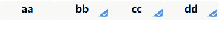

# 微信小程序——列表只可多选，只能选择3项

> 原创 于 2020-12-11 15:04:10 发布 · 990 阅读 · 0 · 0 · 本内容遵循CC 4.0 BY-SA版权协议 版权声明：本文为博主原创文章，遵循 CC 4.0 BY-SA 版权协议，转载请附上原文出处链接和本声明。
> 文章链接：https://blog.csdn.net/qq_43201350/article/details/111035643

**wxml文件** 

```
<view class="demo-page">
    <view class="btn-group" wx:for="{{list}}" wx:key="index">
    <button class="mini-btn  {{item.isChecked ? 'active': ''}}" data-id="{{item.id}}" data-index="{{index}}"
        data-isChecked="{{item.isChecked}}" bindtap="selectFarmer" data-text="{{item.type}}">{{item.type}}
        <iconfont name="iconduigou1" class="iconduigou1" wx:if="{{item.isChecked}}"></iconfont>
    </button>
    </view>
</view>
```

**js文件** 

```
Page({
	data: {
		name: [], 
		list: [{
				id: 0,
				type: 'aa',
				isChecked: false
			},
			{
				id: 1,
				type: 'bb',
				isChecked: false
			},
			{
				id: 2,
				type: 'cc',
				isChecked: false
			},
			{
				id: 3,
				type: 'dd',
				isChecked: false
			}
		],
	},
	select: function (e) {
		const that = this
		const currItem = that.data.list.find(item => e.currentTarget.dataset.id == item.id)
		if (!currItem.isChecked && that.data.name.length >= 3) {
			wx.showToast({
				title: '最多只能选三项！',
				icon: 'none'
			})
		} else {
			currItem.isChecked = !currItem.isChecked
			if (currItem.isChecked) {

				that.setData({
					abc: currItem.type,
					name: [...that.data.name, currItem.type]
				})
				that.setData({
					clickFilterFalg: true
				})
				wx.setStorageSync('clickFilterFalg', that.data.clickFilterFalg)
			} else {
				const findIndex = that.data.name.findIndex(item => item == currItem.type)
				if (findIndex >= 0) {
					that.data.name.splice(findIndex, 1)
				}
			}
		}
		that.setData({
			list: that.data.list
		})
	},
})
```

**效果** 

 

