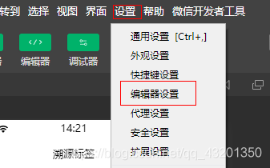
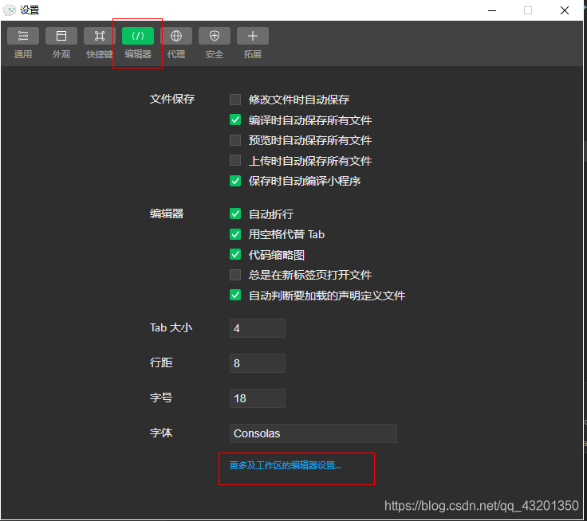
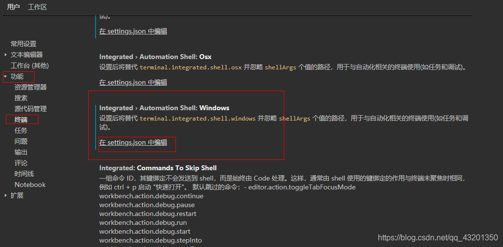
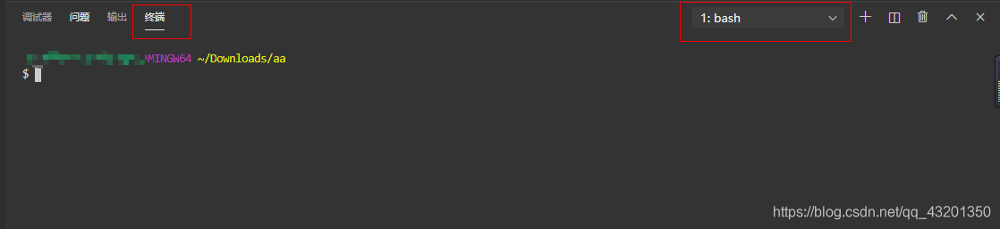

# 微信开发者工具终端配置git

> 原创 于 2020-09-09 14:32:11 发布 · 2.8k 阅读 · 0 · 2 · 本内容遵循CC 4.0 BY-SA版权协议 版权声明：本文为博主原创文章，遵循 CC 4.0 BY-SA 版权协议，转载请附上原文出处链接和本声明。
> 文章链接：https://blog.csdn.net/qq_43201350/article/details/108464217

**第一步：设置——编辑器设置** 



**第二步：编辑器——更多工作区的编辑器设置** 



**第三步：功能——终端** 



**第四步：D:\Git\bin\bash.exe 为git的安装位置** 

```
 "terminal.integrated.shell.windows": "D:\\Git\\bin\\bash.exe",
```

最后：下拉换成bash，就可以优雅地使用git了



