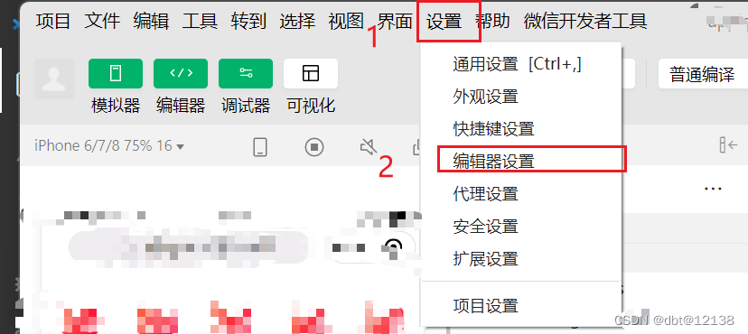
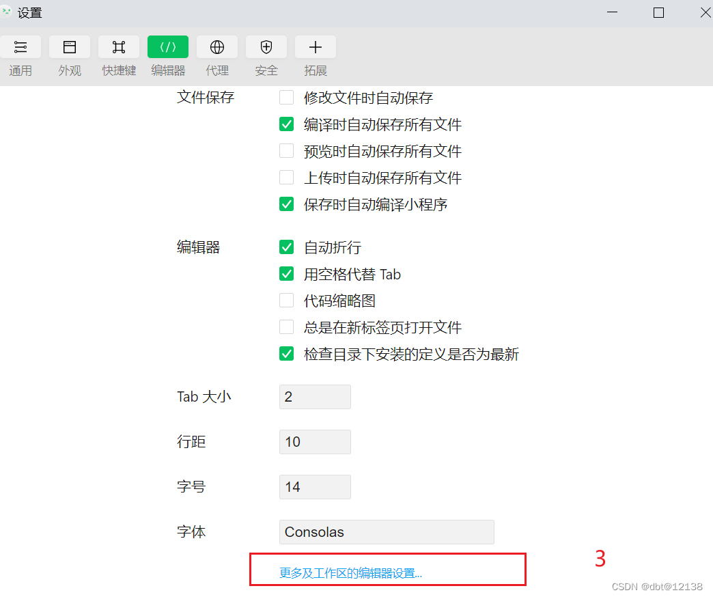
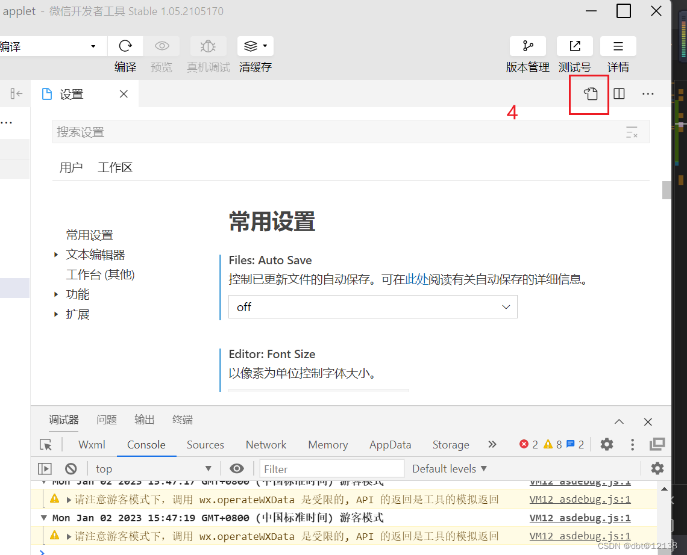
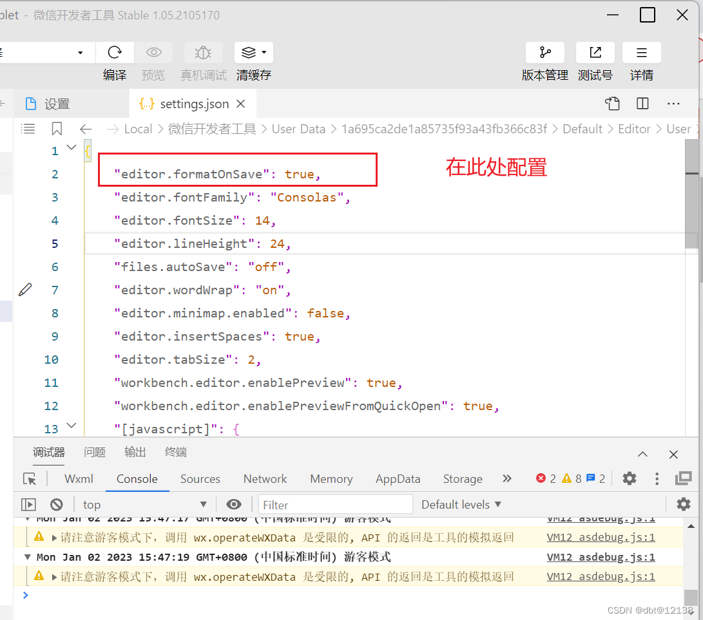

# 微信小程序——微信开发者工具设置保存后实现自动格式化

> 原创 已于 2023-01-02 15:57:48 修改 · 1.2w 阅读 · 9 · 7 · 本内容遵循CC 4.0 BY-SA版权协议 版权声明：本文为博主原创文章，遵循 CC 4.0 BY-SA 版权协议，转载请附上原文出处链接和本声明。
> 文章链接：https://blog.csdn.net/qq_43201350/article/details/118882854

操作步骤如下：
1、打开开发者工具——设置——编辑器设置
 

2、更多及工作区的编辑器设置
 

3、点击右上角文件图标
 

4、setting.json文件配置
 

这是微信开发者工具的初始配置：

```
{
    "editor.fontFamily": "Consolas",
    "editor.fontSize": 14,    // 设置代码行间距
    "editor.lineHeight": 0,
    "files.autoSave": "off",    // 是否自动换行
    "editor.wordWrap": "on",    // 控制是否显示缩略图。
    "editor.minimap.enabled": false,    // 按tab时插入空格
    "editor.insertSpaces": true,
    "editor.tabSize": 4,    // 单击文件，在工作区已经打开的tab区域展示文件内容而不是新开tab展示单击文件内容
    "workbench.editor.enablePreview": true,    // 通过ctrl+p搜索打开的文件，在原来的tab区域展示文件而不是新开tab展示
    "workbench.editor.enablePreviewFromQuickOpen": true
}
```

当你在setting.json中配置了下面这一句的时候，文件保存的时候，就会自动进行格式化。

```
"editor.formatOnSave": true,
```